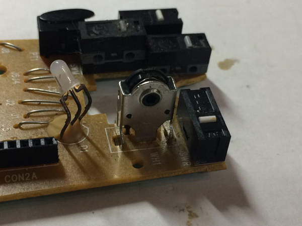
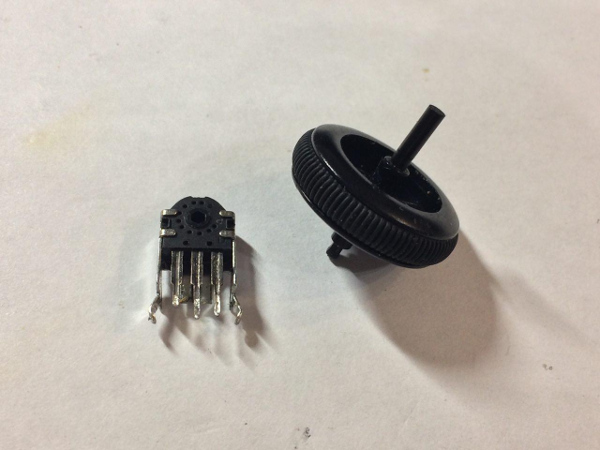
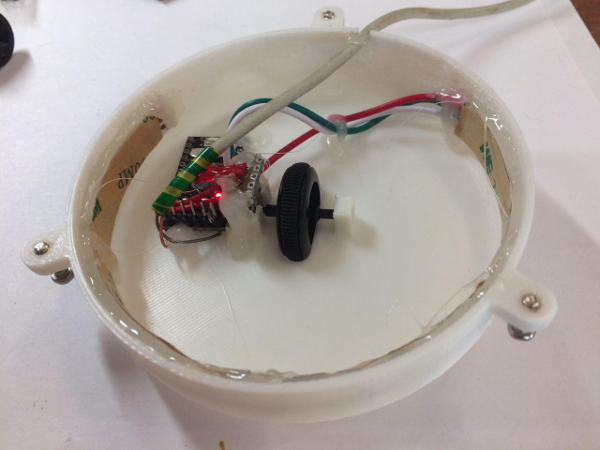

# Simple toy with RGB LEDs for kids
This toy changes colors when you scroll the mouse wheel.

Based on Arduino Pro Mini board:

Wheel with encoder from any PC mouse:

Print the case.STL file:

Solder all together and assemble with a hot glue gun:

Result:

